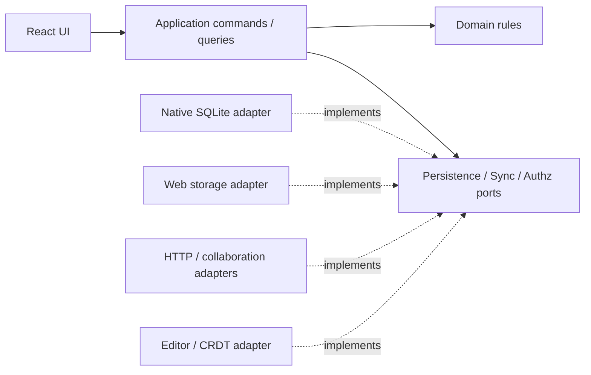

# Greiva本番architecture候補

2026-10-05、設計案。合意済み[統合要件](GREIVA_REQUIREMENTS.md) §2–7/11と[条件付き技術採用](../decisions/poc-technology-selection.md)を具体化する。PoC実装の記述と将来の契約を分ける。提供範囲・共有・運用先は[未決定一覧](PRODUCTION_READINESS.md)。本書はmigration実行や本番提供を開始する指示ではない。

## 責務と依存方向

| 境界 | 所有するもの | 外から渡すもの |
| --- | --- | --- |
| domain | Task/Relation/予定等の規則、ID、date-only/日時、意味的validation | clock/ID生成の値、認可済み対象 |
| application | command、query、端末commit、結果/失敗、操作の文脈 | repository/認可/同期port |
| protocol | version付きwire schema、operation/result、opaque cursor | domainと独立したparse/serialize |
| sync | retry、prepared wire、ACK/pull、projection、収束状態 | durable storeとtransport、lifecycle |
| crdt/editor | Y.Doc schema、相対selection、ProseMirror binding、IME、Undo、ブロック操作 | Page session、durability port、認可状態 |
| infrastructure | SQLite/PostgreSQL、Tauri IPC、HTTP、Auth、Object Storage | 上記portの実装 |
| ui | state表示、form draft、pointer/keyboard、motion、navigation | query snapshotとcommand結果 |

domainにReact/Tauri/DB/HTTP/Yjsをimportしない。Editor固有のDOM/ProseMirror処理をdomainへ押し込めない。UIはSQL・Provider API・同期queueを書き換えず、applicationの操作を呼ぶ。v0.7.0でTask/Relationのdomain intentとportable application portを分離した。現在のPoC UI/同期/保存コードは近接したままで、本番adapterへ接続していない。

要件§4.2のpackages分割を目標にするが、先に公開portと依存制約を決める。folder移動だけで分離完了と呼ばない。PoC全体の一括移動、npm→pnpm変換はこの設計checkpointでは行わない。[技術の実状](TECH_STACK.md)。

## データとcommit境界

1. Page本文はY.Doc binary正本。Editor更新→端末binary commit→送信の順を保つ。検索/preview JSONは派生物で、本文を置き換える材料にしない。
2. Task等はローカルentity/operationを同じtransactionで保存し、server entity/不変operation履歴へ同期する。ACK/receipt保存とpending解消、pull適用/cursor更新も原子的にする。
3. UI即時反映・端末保存完了・server同期完了・Conflict解決を別の状態として扱う。保存失敗は後続送信を止め、未保存内容の保管導線を示す。
4. PageとTaskを組み合わせるcommandは、単一DB内でもYjs生成/保存/structured操作の境界を定義する。外部配信は同じtransactionへ含めない。複数actionにはexecution履歴・再試行・部分完了が必要で、未実装の全体atomicityを宣言しない。

起動/復帰は端末復元→認可/session再確認→pull→pending push→再pull。認可やnetworkが使えない間も、許可済みの端末データへのoffline操作の方針を持つ。ただし失効後のoffline閲覧・共有取消・device logout時の保管は未決定で、無期限のoffline権限を仮定しない。

## Workspaceとserver境界

API、collaboration、workerは同じworkspace/resource認可契約を参照する。clientが送るworkspaceId/clientId/doc名をアクセス権の証明にしない。Page CRDT接続でもtokenとPage所属/操作権限を検査し、pull/projection/export/AIの読取にも同じ境界を適用する。

PoCのAPIにはAuth/workspace認可がなく、collaborationはdocument名とclientIdの形式だけを検査する。これを公開serviceへそのまま配置しない。role/RLS契約とcross-workspace拒否試験を本番接続より先に実装する。個人版でも他利用者のデータを分離する責務は残る。

## 配置候補

- Windows/Android: React＋Tauri shell、端末SQLite。委任に基づき既存Rust/sqlx repository＋Tauri IPCを基準にし、port接続と移行を個別検証する。
- Web: React、worker内local store、CRDTの耐久化。OPFS/fallbackとy-indexeddbの正本/commit境界を先に確定する。
- API: NestJS/Fastify＋Repository＋Drizzle/PostgreSQL。collaboration: Hocuspocus＋durable binary store。workspace認可とschema互換を共有する。
- worker: projection/index、外部adapter、Automation/AI execution。通常UIと同じcommand/認可を通す。提供前に運用責務とretry上限を決める。

Supabaseは要件の第一候補で、instance/秘密鍵/課金/endpointは未設定。PoCのloopback port、開発volume、Docker secret例を本番契約にしない。添付/音声とCRDT/structured DBは正本が異なり、backup manifestで整合する復元単位を定義する。

## 移行・検証と進行条件

新schemaへ書く前にversion判定、online backup、ID/本文binary/操作履歴の検査、失敗時の復旧を用意する。未知の新schemaを旧appで再初期化しない。具体案は[データモデル](DATA_MODEL.md)、同期は[SYNC_SPEC.md](SYNC_SPEC.md)。

最初の実装単位はport/依存規則とfixtureによる保存契約。次にworkspace/認可を追加する場合はprotocol・cursor・client identityのmigrationを一緒に設計する。UI刷新や新DB/Calendarを先に増やして保存/認可の不足を隠さない。選んだ提供OSの実IME/lifecycle/復旧、他workspaceへの拒否、ACK喪失/duplicate/cursor復旧、schema migrationを受入へ含める。
