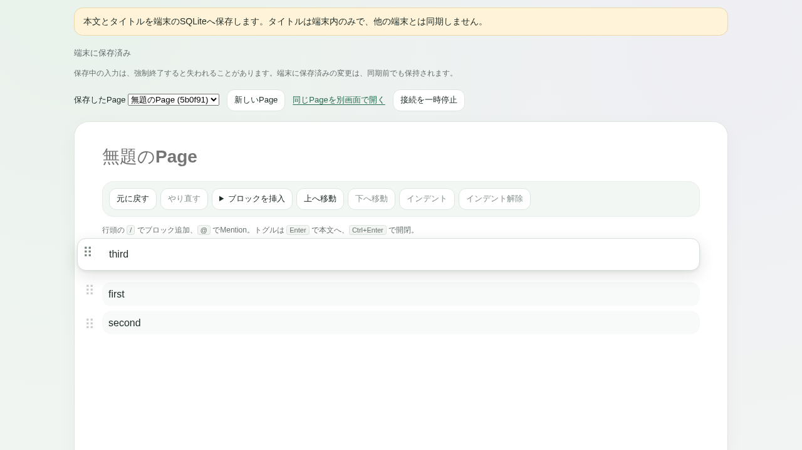
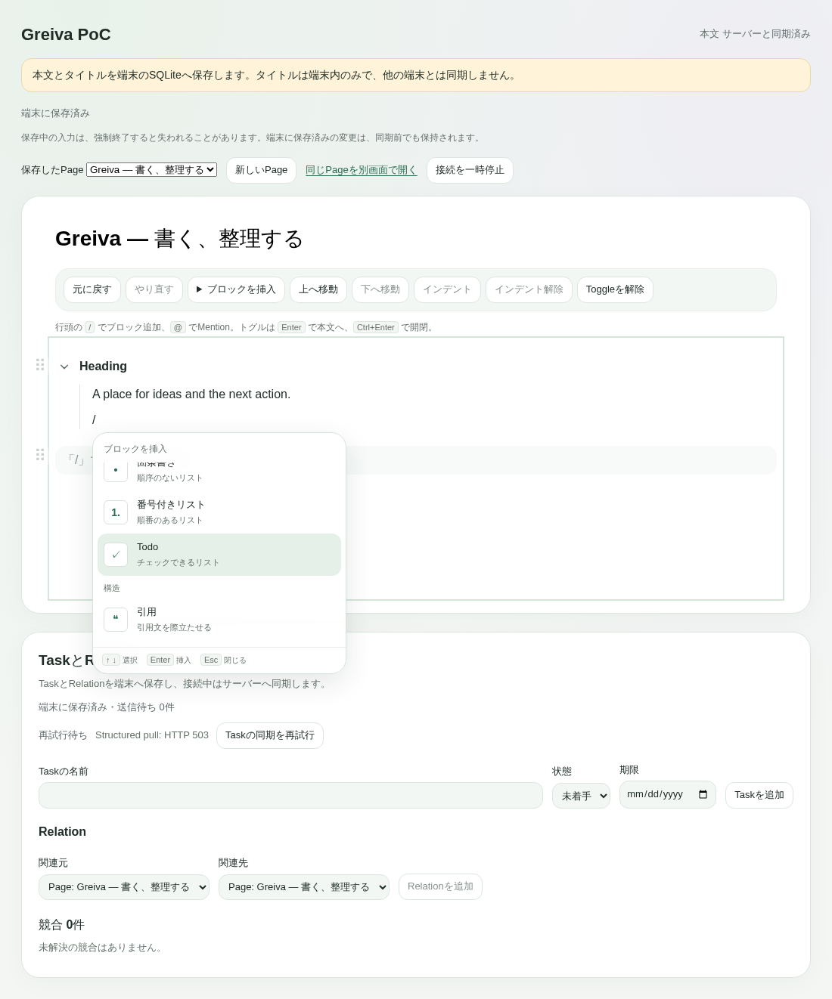

# Block dragの行プレビュー（0.6.19）

2026-10-04。利用者指定により、線中心の表示を、持ったblockの実際の内容・ハンドル・軽い影と、周囲が場所を空ける表示へ変更する。追加指定に合わせ、横位置・幅を保って上下だけ動く行へ改訂し、ハンドル列でdropできない問題を修正。丸いblock・共通control・短い動き・小さいmenuの透明感も反映した。既存の移動transaction／Undo／保存schemaは変更しない。PoC Step 8の既存操作の改善（PATCH）。

## 表示と操作

- ドラッグ中は本文・block DOMの属性を変更せず、外部stylesheetのtransform／opacityだけで移動先を示す。元の高さ・間隔で場所を空け、hit-testには移動前の位置を使う。本文を保存し直すのはdrop時の既存transactionだけ。
- 行は元の列と幅を保つ。候補線を非表示にし、表示用cloneはinert／aria-hidden、重複IDを除去する。Pointerの上下移動に追従し、左右移動で列から離れない。
- drop／Escape／外へのdrop／window blur・resize／composition開始／遠隔本文変更／Editor破棄で表示とlistenerを解除する。staleなcustom dragは文字列の通常dropへ流さない。
- Undo/Redo、keyboard移動、入力focus／選択を保持する。reduced motionでは周囲の移動アニメーションを止める。
- Document captureで私有MIMEのdragだけを処理し、Editorの左40pxを含む行領域でpreview／dropを判定する。widgetのstopEventによる選択保護を残し、本文側へ横移動せず、同じ列をまっすぐ上下へ動かせる。行領域の外・stale dragは他のinputへ文字を入れない。
- Material 3／Apple Materialsを参考に、blockの丸み・淡い背景、共通control／panelの角、120／180msの状態変化、blurを小さいmenuに限定する表現を追加。本文surfaceは不透明。blur非対応・reduced transparency・forced colorsのfallbackを用意。native Liquid Glassの光学効果や動的壁紙色は実装していない。

## Dockerとbuild

[verification.json](verification.json)・[型](TYPECHECK.log)・[通常48 Pass／DB専用20 skip](UNIT.log)・[全58 E2E](E2E.log)・[原report](playwright.json)。全58件には行の表示・列／幅の保持、本文／選択不変、drop・Undo/Redo、Escape、実Hocuspocus peerの変更での中断、複数行の高さ、下方向移動、reduced motion、外drop、ハンドル列だけの移動／titleへのdrop取消を含む4件の追加試験がある。通常runのPostgreSQL20 skipは未実行として保持し、以前の[実DB別run20 Pass](../windows-native-editor-20261003/skipped-recheck/audit.json)と区別する。今回はAPI／同期schemaを変更していない。

[build controller](build.mjs)・[build.json](build.json)・[normal frontend](BUILD.log)・[release cross-build](RELEASE-CROSS.log)。98 program/config/testファイルをhost inventoryとDocker sourceで照合し、test frontend flag=0、crash hookなし、main window dragDropEnabled=falseを確認。最終exeは13,094,912 bytes、SHA256 `d70e2dbad93d36bf147cc1eb4edfbdedbab6b388848173583fe41b5413079a48`。[version audit](version-audit.json)でapp所有manifest／lockfileを0.6.19へ整合し、外部npm314 entry／Cargo依存不変を確認した。

## Windowsと最初の改訂

identifier `dev.greiva.poc.drag619`、Page `01a10300-0000-7000-8000-000000000001`／WIN619-DRAGの新しい隔離保存先を使用する。[seed](seed.json)はDockerの実Rust storeで作成。最初のseedはWALを含めずmain DBだけコピーしたため空Pageとなり、準備を訂正。停止済みseedへcheckpointを行ってからコピーした。製品のデータ欠落とは扱わず、旧IME fixture／通常保存先は編集しない。

最初の自由に浮くカード版（[first-build.json](first-build.json)、SHA256 `7c288a410b8e6855185f0b1a55e36038a34fd1d83b7f4848b966b6cdd1f2ec39`）で、利用者がカード・周囲の移動・物理drag・Ctrl+Z・空行が増えないこと・保存表示を確認し「できました」と回答。[read-only online backupの監査](native-first-audit.json)では3更新（seed→H3/H2へ移動→元の全文）を確認、全digest一致、余分な段落なし。Windowsの既存Node SQLite backup APIで28 pageをコピーし、Greivaは開いたまま。raw SQLiteはGitへ含めない。これは旧0.6.17の最初の空段落異常を説明・解消する証拠ではない。

その後、利用者のYouTube playlist風という追加指定で列に沿う行へ改訂。利用者は表現を評価した一方、ハンドル列だけでは移動せず本文側へずらす必要があると報告。SQLite online backupには4件目のH3→H2移動があり、再度のUndoは記録されていない。本文は書き換えず保存履歴を保全し、[同じ列の再現試験](gutter-before-failed.json)で元の順序が変わらないことを確認してからcaptureの判定範囲を修正。最終candidateのnative物理操作／見た目は別途確認する。最初の版のnative Passを最終candidateへ転記しない。Computer Useは前面化がfresh選択からの再試行でも失敗、後のread-only captureも別windowの画像を返したため画像を証拠に採用せず、入力せず解除した。最新実Microsoft IMEと1,000 blockのnative連続入力、正式Gateは未確認。

最終修正版で同じ列のまま下のH2を上へdrag→Ctrl+Zと見た目を確認する依頼に、利用者が「良さそうです」と回答。[最終online backup監査](native-final-audit.json)は4→13更新を確認した。9更新には複数の見出し移動／戻しと空段落の位置変更／戻しがあり、全て元の4 blockの順序変更のみ。文字・blockの重複／欠落・余分な段落なし、titleと旧4更新は不変。最終本文はH2→H3、最初のseedと一致する。試験直前のH3→H2とは異なるため、単一の操作と最後のUndoだけで直前へ戻ったという断定はしない。保存YjsからUndo originを独立に特定できないことと、利用者の操作確認を区別する。Pageは編集せず開いたまま、Computer Use解除。

## 失敗・訂正を保持

- [最初のdrag timeout 4件](initial-drag-failed.json)：本文内の表示属性を直接更新する初案でdrag開始時に停止。本文外CSSへ変更後、実pointer試験がPass。DOM再解析・widget交換を避ける実装にしたが、browser内部の原因を独立に証明したものではない。
- [reduced motion検査Fail](reduced-motion-failed.json)：media ruleのspecificity不足で160msが残り、同じselectorへ変更して停止を確認。
- 列表示のfocused runでShift+Left直後のselectionchangeを待たずsnapshotを取ったため期待値が未選択になった。選択幅1をpollしてから保存するよう試験を訂正し、保持のassertionは維持した。
- 丸いblockのhover CSSがdragのtransitionを上書きした。[57 Pass／1 Fail](rounded-motion-failed.json)ではreduced motionに0sが2つ返る検査差も表面化。通常blockのselectorを低specificityにし、dragのtransform transitionとreduced motionを再確認した。正常時にもtransformのtransitionが有効であることを試験で確認する。
- [最初のnative監査の仮定Fail](audit-assumption-failed.log)は、単一のdrag→Undoで試験直前の順序へ戻ると仮定した期待値が、実際の9更新に合わなかった。原scriptを[audit-native-first-assumption.mjs](audit-native-first-assumption.mjs)へ保持。監査を純粋なblock順序変更・内容保持・実際の最終順序の照合へ訂正し、差を上記へ明示した。保存履歴や利用者のPageは変更しない。

最新の[UI品質基準](../../../docs/development/ui-quality.md)は利用者指定を共通化した方針であり、全画面の改修完了やnative性能の合格を意味しない。
